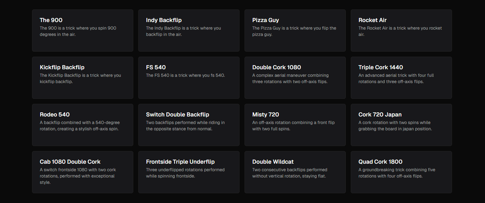

# [Sortable](https://sortable.sadmn.com)

This is a sortable built with `shadcn/ui`, `radix ui`, and `dnd-kit`. It is bootstrapped with `create-t3-app`.

[](https://sortable.sadmn.com)

## Tech Stack

- **Framework:** [Next.js](https://nextjs.org)
- **Styling:** [Tailwind CSS](https://tailwindcss.com)
- **UI Components:** [shadcn/ui](https://ui.shadcn.com)
- **Drag and Drop:** [dnd-kit](https://dndkit.com)
- **Validation:** [Zod](https://zod.dev)

## Features

- [x] Headless `Sortable` ui primitives built with `shadcn/ui`, `radix ui`, and `dnd-kit`.
- [x] Integration with `useFieldArray` of `react-hook-form`, and `tanstack-table`.

## Running Locally

1. Clone the repository

   ```bash
   git clone https://github.com/sadmann7/uploader
   ```

2. Install dependencies using pnpm

   ```bash
   pnpm install
   ```

3. Start the development server

   ```bash
   pnpm run dev
   ```

## How do I deploy this?

Follow the deployment guides for [Vercel](https://create.t3.gg/en/deployment/vercel), [Netlify](https://create.t3.gg/en/deployment/netlify) and [Docker](https://create.t3.gg/en/deployment/docker) for more information.
